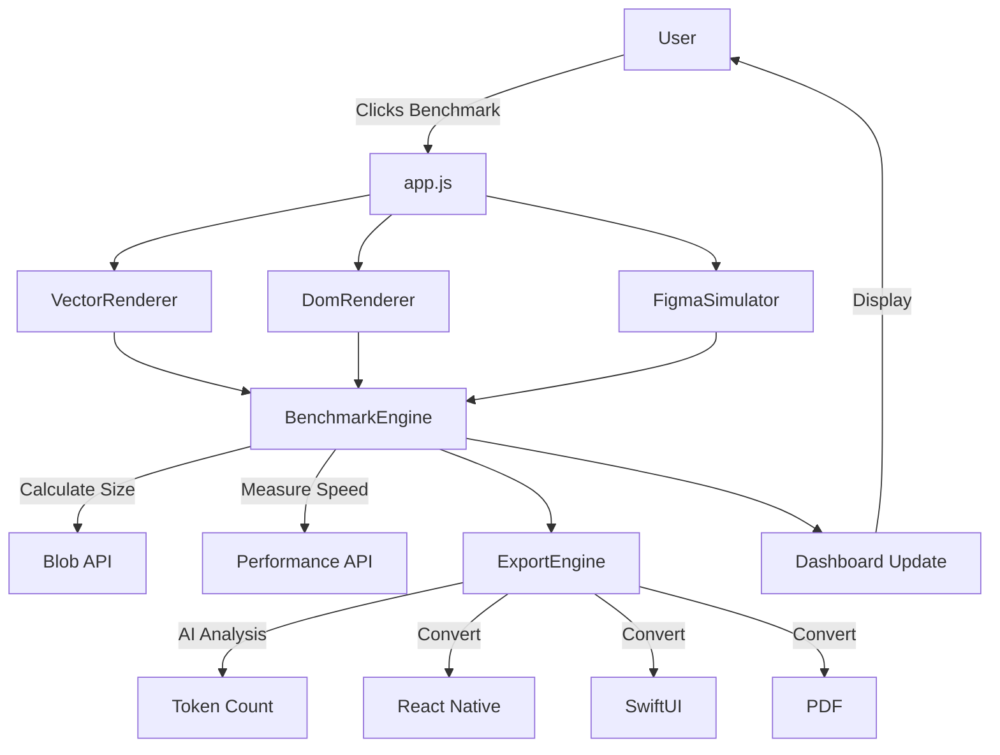

# Architecture & Structure

## 1. Directory Structure

```
UI-Matrix-Benchmark-Vector-Logic-Manifesto-AI-Adaptive-PWA/
├── .git/                      # Git repository
├── .gitattributes             # LF enforcement
├── .gitignore                 # Exclusions (.env, node_modules)
├── .kiro/
│   └── steering/
│       ├── product.md         # Vision document
│       ├── tech.md            # Technology stack
│       └── structure.md       # This file
├── AGENTS.md                  # Source of Truth for AI agents
├── LICENSE                    # MIT license
├── README.md                  # Project documentation
├── mcp.json                   # MCP tools configuration
├── index.html                 # Main dashboard UI
├── manifest.json              # PWA configuration
├── sw.js                      # Service Worker
├── styles/
│   └── main.css               # Cyberpunk theme
└── src/
    ├── generators/
    │   ├── vector-renderer.js    # Mathematical SVG generation
    │   ├── dom-renderer.js       # Traditional HTML approach
    │   └── figma-simulator.js    # Static export simulation
    ├── benchmark-engine.js       # Performance measurements
    ├── export-engine.js          # Multi-format conversion
    └── app.js                    # Main application logic
```

## 2. Data Flow



## 3. Core Components

### 3.1 VectorRenderer
**Purpose:** Generate UI using pure mathematical formulas

**Input:** `props = { title, description }`  
**Output:** SVG string

**Key Methods:**
- `render(props, scale)`: Main rendering function
- `advanceY(height, gap)`: Stack layout calculator
- `getPayloadSize()`: Byte size measurement

**Design Tokens:**
```javascript
WIDTH = 360
HEIGHT = 680
PADDING = 16
BORDER_RADIUS = 16
GOLDEN_RATIO = 1.618
```

### 3.2 DomRenderer
**Purpose:** Traditional HTML/CSS approach (for comparison)

**Input:** `props = { title, description }`  
**Output:** HTML string

**Characteristics:**
- Verbose inline styles
- Multiple nested divs
- Intentionally "bloated" for demonstration

### 3.3 FigmaSimulator
**Purpose:** Simulate Figma JSON export

**Input:** `props = { title, description }`  
**Output:** Large JSON structure

**Characteristics:**
- Nested layer hierarchy
- Verbose metadata
- Padding with unnecessary data

### 3.4 BenchmarkEngine
**Purpose:** Measure and compare performance

**Methods:**
- `calculatePayload(content)`: Byte size via Blob API
- `measureRenderSpeed(fn)`: Time via Performance API
- `stressTest(fn, count)`: Multi-iteration testing
- `runBenchmark(renderers)`: Complete suite
- `updateDashboard(elements)`: UI updates

### 3.5 ExportEngine
**Purpose:** Multi-format conversion and AI analysis

**Methods:**
- `toReactNative(props)`: Generate .tsx code
- `toSwiftUI(props)`: Generate .swift code
- `toPDFInstructions(props)`: Generate PostScript
- `analyzeAIFriendliness(content)`: Token count, parsability
- `calculateAIScore()`: 0-100 scoring

## 4. UI Components (HTML)

### Dashboard Layout
```
┌─────────────────────────────────────┐
│ Header (Title + Badges)            │
├─────────────────────────────────────┤
│ Control Panel                       │
│ ├─ Scale Slider                     │
│ ├─ Run Benchmark Button             │
│ ├─ Stress Test Button               │
│ └─ Export Test Button               │
├─────────────────────────────────────┤
│ Results Grid (3 columns)            │
│ ┌────────┬────────┬────────┐        │
│ │Vector  │  DOM   │ Figma  │        │
│ │(Winner)│        │        │        │
│ │Metrics │Metrics │Metrics │        │
│ │Preview │Preview │Preview │        │
│ └────────┴────────┴────────┘        │
├─────────────────────────────────────┤
│ Export Formats Section              │
│ (React Native │ SwiftUI │ PDF)      │
├─────────────────────────────────────┤
│ Efficiency Summary Table            │
├─────────────────────────────────────┤
│ Footer (Credits + Links)            │
└─────────────────────────────────────┘
```

## 5. Rendering Pipeline

### Vector Rendering Flow
```javascript
1. reset() → currentY = 0
2. Set scale-adjusted dimensions
3. For each UI element:
   a. Calculate position: y = currentY
   b. Generate SVG markup
   c. advanceY(elementHeight, gap)
4. Assemble final SVG with viewBox
5. Return string
```

### Benchmark Flow
```javascript
1. User clicks "Run Benchmark"
2. For each renderer (Vector, DOM, Figma):
   a. performance.now() → start
   b. renderer.render(props)
   c. performance.now() → end
   d. Calculate: time = end - start
   e. Calculate: size = new Blob([output]).size
3. Run AI analysis on all outputs
4. Calculate efficiency multipliers
5. Update dashboard with results
6. Console.log detailed report
```

## 6. PWA Architecture

### Service Worker Strategy
**Cache-First:** Static assets served from cache

```javascript
1. Install: cache core assets
2. Fetch: 
   - Check cache first
   - If hit: return cached
   - If miss: fetch from network, cache, return
3. Activate: cleanup old caches
```

### Offline Capabilities
- ✅ Full UI navigation
- ✅ Benchmark execution
- ✅ Export generation
- ❌ GitHub Pages deployment (requires network)

## 7. AI Integration Points

### For "Yana" AI Assistant

**Input:** Natural language requirement
```
"Create a Diia upload screen with title and file picker"
```

**Processing:** LLM generates mathematical description
```javascript
{
  components: [
    { type: "title", text: "...", y: "24" },
    { type: "uploadZone", y: "auto", height: "120" },
    { type: "button", y: "auto", label: "Далі" }
  ]
}
```

**Output:** VectorRenderer converts to SVG
```xml
<svg>...</svg>
```

### AI-Friendly Characteristics
1. **Predictable structure:** Always follows same template
2. **Numeric parameters:** Easy for AI to generate/modify
3. **Mathematical relationships:** AI can optimize formulas
4. **Small token count:** Fits in LLM context window

## 8. Security Model

### Threat Model
- **XSS via SVG:** Mitigated by no `<script>` tags
- **Injection via props:** Template literals auto-escape HTML
- **Service Worker hijacking:** HTTPS-only deployment

### Trust Boundaries
```
User Input → Sanitize → Renderer → Sandboxed SVG → Display
```

## 9. Performance Optimization

### Vector Renderer
- ✅ Single DOM node (one `<svg>`)
- ✅ GPU-accelerated (SVG transforms)
- ✅ No layout reflows (fixed viewBox)

### DOM Renderer (Intentionally Unoptimized)
- ❌ Multiple DOM nodes (50+ divs)
- ❌ CSS recalculations (inline styles)
- ❌ Layout shifts (flex/grid)

## 10. Future Architecture (Post-Contest)

### Phase 2: Modular Components
```
src/
├── core/
│   ├── vector-engine.ts
│   └── layout-calculator.ts
├── components/
│   ├── diia-header.ts
│   ├── diia-button.ts
│   └── diia-upload-zone.ts
└── integrations/
    ├── diia-api-client.ts
    └── yana-llm-connector.ts
```

### Phase 3: Real Diia Integration
- Connect to Diia Design System API
- Fetch component specs dynamically
- Generate full application flows
- Deploy to Diia infrastructure

## 11. Critical Success Factors

1. **Visual Clarity:** Side-by-side comparison must be obvious
2. **Performance Proof:** Numbers must speak for themselves
3. **AI Narrative:** Clearly show why this helps LLMs
4. **Diia Alignment:** Use official colors/fonts/language
5. **Demo Reliability:** Must work offline (service worker)

## 12. Known Limitations

1. **Not production-ready:** This is a proof-of-concept
2. **Single component:** Only demonstrates upload screen
3. **No state management:** Static props, no interactivity
4. **Desktop-optimized:** Mobile layout could be improved

**These are intentional:** The goal is to prove the concept, not build a full framework.
